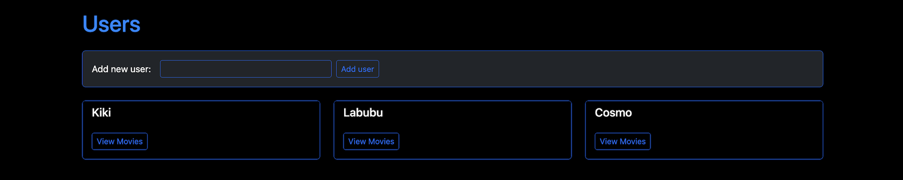

# 🎬 FILMINATOR 9000 v2 – Movie Manager Web App – Flask + SQLAlchemy + OMDb API
Filminator 9000 is a Python-based Flask web application that allows users to manage their own movie database through a sleek and interactive browser interface. Instead of a command-line tool, the project now delivers a fully dynamic web experience, using Flask for routing and templating, and SQLAlchemy as the database ORM.

The app connects to the OMDb API to fetch detailed movie information — including posters — which are then stored in a local SQL database. Users can easily add, view, update, or delete movies through intuitive web forms. The application dynamically renders HTML pages using Jinja templates, displaying movie data in clean, responsive Bootstrap-styled cards.

Whether you're a film enthusiast or learning web development, MoviWeb demonstrates how to build and deploy a full-stack Flask app that combines real-world APIs, database integration, and user-friendly UI — all in one project.

# 💡 What Problem Does It Solve?
* Search and add movies using the OMDb API
* Store movie data in a structured SQL database
* View their collection in a visually appealing way with movie posters
* Easily update or delete entries through the browser

# 👥 Intended Audience
* 🐍 Python beginners learning Flask, APIs, and web development
* 🎓 Students building portfolio projects with real-world tools
* 🎬 Movie enthusiasts who want a personalized, web-based movie collection
* 💻 Developers practicing full CRUD (Create, Read, Update, Delete) operations with Flask and SQLAlchemy
* 🧠 Anyone interested in turning API data into interactive, styled websites

# 🚀 Usage
*✅ Prerequisites*
* Python 3.8 or higher
* Flask-based web environment
* Flask, SQLAlchemy, python-dotenv, and other packages (see requirements.txt)
* OMDb API key (free signup)

# ⚙️ Configuration
This project uses environment variables to store API keys and configuration settings.
* Flask - Web framework.
* SQLAlchemy – ORM for SQLite or other databases.
* dotenv (python-dotenv) – Loads sensitive values like API keys from a .env file.
* requests – Fetches data from the OMDb API.
* os – Handles environment variables and paths.
* jinja2 - Renders dynamic HTML templates.
* Bootstrap - Styles the front end with responsive cards and forms.

